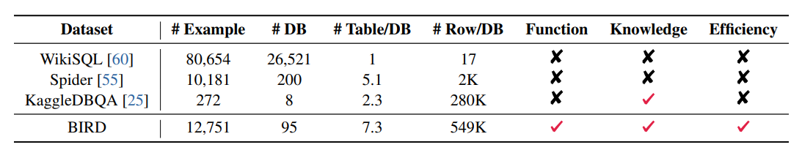

# Improvado Text2SQL Homework

This repository is dedicated to Text2SQL task. It contains simple and scalable tool for using HF and OpenAI Models for Text2SQL.

## How to use it

*It is highly recommended to use [Tutorial](./src/tutorial.ipynb), where one can find the usage and details of the customizing this repo.

The basic usage relies on changing configs and using builded classes to work with models and prompts. 

Every model should be called with 2 main configs ```HF_LLMQuery(MODEL_CONFIG, PROMPT_CONFIG)```:
 - [MODEL_CONFIG](#MODEL_CONFIG)
 - [PROMPT_CONFIG](#PROMPT_CONFIG)

Then model could be queried with method ```query()``` where question is passed and some extra arguments if needed.

#### MODEL_CONFIG

##### HF Configs

Consists of multiple fields
- TokenizerClass - Class for tokenizer from ```transformers``` should be passed
- ModelClass - Class for model from ```transformers``` should be passed
- model - parameters passed inside the model init
  - pretrained_model_name_or_path - the name of model
- tokenizer - parameters passed inside the tokenizer init
  - pretrained_model_name_or_path - the name of tokenizer
- generation_args - all possible generation arguments that could be used with ```.generate()``` method

Example:
```yaml
TokenizerClass: AutoTokenizer
ModelClass: AutoModelForSeq2SeqLM

model:
  pretrained_model_name_or_path: juierror/flan-t5-text2sql-with-schema
tokenizer:
  pretrained_model_name_or_path: juierror/flan-t5-text2sql-with-schema
generation_args:
  max_new_tokens: 32
  num_beams: 12
```

##### OpenAI Configs

Consists of multiple fields
- token - openai token used for generation
- generation_args - all possible generation arguments that will be passed into openai api call
  - model - the name of the model, that will be called

Example:
```yaml
token: <your token>
generation_args:
  temperature: 0
  max_tokens: 4096
  top_p: 1.0
  frequency_penalty: 0.0
  presence_penalty: 0.0
  model: gpt-3.5-turbo
```

#### PROMPT_CONFIG

Consists of multiple fields
- PromptClass - class from ```prompt_schema.py``` that will be used to create proper model prompt
- prompt_configs - configs that are passed directly to the prompt to alter it
  - few_shot_text - text, that will be used as a few-shot example before the user query. If passed empty, then count as zero-shot
  - instruction_text - text, that will be used as an instruction for "system", how it should act. Could be empty as well

Example:
```yaml
PromptClass: SimplePrompt
prompt_configs:
  few_shot_text: "question: get people name with age equal 25 table: id, name, age \n SELECT name FROM table WHERE age = 25"
  instruction_text: "Act as a professional SQL developer and answer a question with a step by step reasoning"
```

## Structure

    .
    ├── ...
    ├── src                     # all the source files
    │   ├── configs          # Config Files
    |   |     ├── database   # Database credentials
    |   |     |    ├── db_credentials.yaml
    |   |     ├── models     # Models configs
    |   |     |    ├── hf_model_config.yaml
    |   |     |    ├── openai_model_config.yaml
    |   |     ├── prompts    # Prompts configs
    |   |     |    ├── One_shot.yaml
    |   |     |    ├── QDecomp.yaml
    |   |     |    ├── Zero_shot.yaml
    │   ├── prompting         # Prompt Schemas
    |   |     ├── hf_prompt_schemas.py        # Schemas for HuggingFace Models
    |   |     ├── openai_prompt_schemas.py    # Schemas for OpenAI Models
    │   ├── tutorial.ipynb                    # User Tutorial
    |   └── models.py                         # Models source code
    └── ...


## Papers overview

### COT
Chain of thought prompting increases models answers quality. That is true for solving simple math problems.
Authors outline that the larger model is the better COT will work.

authors say that COT will work if
1) the task is challenging and requires 18 multi-step reasoning
2) a large language model is used
3) the scaling curve is relatively flat


Standart Prompt:
Q: Roger has 5 tennis balls. He buys 2 more cans of tennis balls. Each can has 3 tennis balls. How many tennis balls does he have now? 
A: The answer is 11.

COT prompt:
Q: Roger has 5 tennis balls. He buys 2 more cans of tennis balls. Each can has 3 tennis balls. How many tennis balls does he have now? 
A: Roger started with 5 balls. 2 cans of 3 tennis balls each is 6 tennis balls. 5 + 6 = 11. The answer is 11.

https://arxiv.org/pdf/2201.11903.pdf

### Exploring Chain-of-Thought Style Prompting for Text-to-SQL

1) Chain of thought 
reasoning through the output
2) Least to most
First apply the reduction of the task, second solve the reducted task and the initial 

Ex. Show first name, last name, age for all female students. Their sex is F. -> 
reduction. Show first name, last name, age for all female students
solution. Their sex is F.

Looks like reasoning but more guided.

3) Question Decomposition Prompting

Proposed method of decomposition via COT. 

4) QDP + InterCOL
Additional information with columns and rows names

https://arxiv.org/pdf/2305.14215.pdf

### Can LLM Already Serve as A Database Interface?

Containing 12,751 pairs of text-to-SQL data and 95 databases with a total size of 33.4 GB. 

Feels like validated extra data.  

#### Metrics:

1) Accuracy
2) Valid Efficiency Score = $\sum \cfrac{I\{\text{valid} \} R(V,\hat{V})}{N} \quad R = \sqrt{\cfrac{E(V)}{E(\hat{V})}}$
E - measure of efficency, ex. running time. 


#### Ideas
could be used in prompting
"First, our database experts create a description file explaining all column names, abbreviated values, value types, and external knowledge for each database to help annotators better understand the database contents."

https://arxiv.org/pdf/2305.03111.pdf
